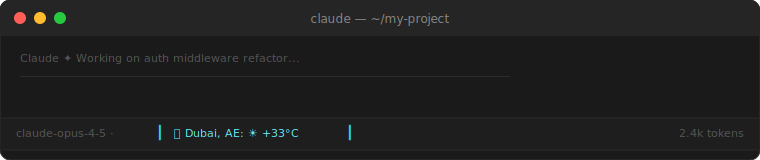
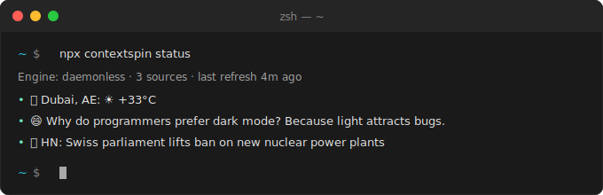
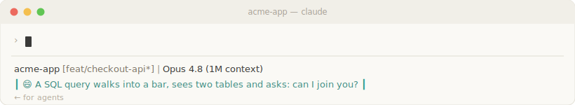

# ContextSpin Plugin

Live context in your Claude Code **status bar** — weather, the top Hacker News stories, fresh AI research papers, dev articles, PRs awaiting your review, failing CI, incidents, meetings — pulled from tools you already run. Auto-configures on install; the bar is never empty.



*Your existing statusline stays on top; the ContextSpin line is composed beneath it — never replacing it.*

A thin Claude Code plugin wrapper around the [contextspin](https://www.npmjs.com/package/contextspin) npm package.

## Don't need the plugin?

The same setup is one line, no marketplace required:

```bash
curl -fsSL https://raw.githubusercontent.com/mannutech/contextspin/main/install.sh | bash
```

`npx contextspin install` / `uninstall` do the same. The plugin just packages this for marketplace install.

## What's in it

| Component | Purpose |
|---|---|
| Skill: `contextspin` | One skill for everything — status, add/remove sources, tweaks, troubleshooting |
| MCP server: `contextspin` | Exposes snippet/cache data to Claude (`get_snippets`, `get_daemon_status`, `start_daemon`, `stop_daemon`) |
| SessionStart hook | Auto-configures the config + statusline each session (runs `contextspin ensure`) |

## Setup

Nothing to do. On install, the hook seeds a no-credentials starter pack (weather, a dad joke, top HN stories, AI research papers, dev articles, a daily quote) and wires your statusline — live and never empty from the next session.



The bar is **never empty** — before you've wired anything (or when every source is quiet), it rotates through a built-in joke and onboarding hints:



Then just ask Claude:

> "Add my GitHub review requests to the statusline" · "Remove the joke source" · "Turn off the colors"

Or edit `~/.contextspin.json` directly — see [source examples](skills/contextspin/references/source-examples.md) (`mcp`, `cli`, and `http` sources for Slack, GitHub, Jira, Grafana, k8s, and more).

## Removing it

> ⚠️ **Removing the plugin does NOT remove ContextSpin.** The statusline wiring lives in `~/.claude/settings.json` (written by the hook), not in the plugin — Claude can't clean it up on plugin removal. To fully remove it:
>
> ```bash
> npx contextspin uninstall
> ```

## Links

- npm: https://www.npmjs.com/package/contextspin
- GitHub: https://github.com/mannutech/contextspin
